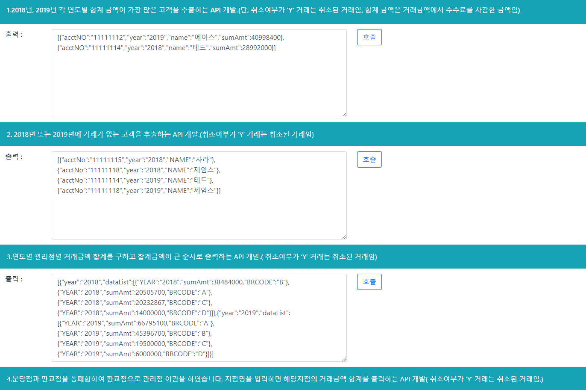

# BankProject

## 개발환경
- 개발프레임 워크 : SPRING BOOT
- 개발언어 : JAVA,  MariaDB, Javascript, HTML, CSS, mybatis
- 오픈소스 : boot strap
- 빌드 : maven

## DB 테이블명 정의서
**사용한 DB : mariaDB**
- 고객 거래내역 데이터 => tran_list
- 고객 데이터 => account
- 지점 데이터 => branch

## Data configuration
    spring.datasource.url={url}
    spring.datasource.username={id}
    spring.datasource.password={password}

## 실행방법
1. 소스 다운로드
2. Spring boot상의 자체 서버 실행
3. http://localhost:8080/bankAPItest url 호출
4. API 단위테스트 페이지 Open -> 호출 버튼으로 API별 단위TEST 진행

## 문제해결 방법
1. API1
- 전체 입금내역을 계좌별, 년도별 GROUPING 을 하여 그룹별(년도) 내림차순으로 rownumber을 매긴 후 rownumber 1번만 출력해줍니다.

2. API2
- 거래내역이 있는 전체 년도 추출 후 고객 데이터와 '1'이라는 TMP 필드를 줘서 년도별 고객의 데이터 라인을 생성합니다.
  고객의 데이터와 년도별, 계좌별로 group by를 해서 고객 데이터 outer join을 한 뒤 거래내역이 null인 고객데이터를 가져와서 출력해줍니다.
  
3. API3
- 년도 정보를 파라메터로 설정하여 해당년도에 합계금액을 년도별로 조회해 옵니다.
- 년도 정보를 받아서 따로 List를 변수를 생성하여 년도 정보를 넣은 Map 데이터를 add해 줍니다.

3. API4
- view 단에서 ajax호출로 지점명을 받습니다. 
- 지점명을 파라메터로 합계금액을 조회했을 때 결과가 사이즈가 0이면 에러코드를 입력하여 출력해줍니다.

